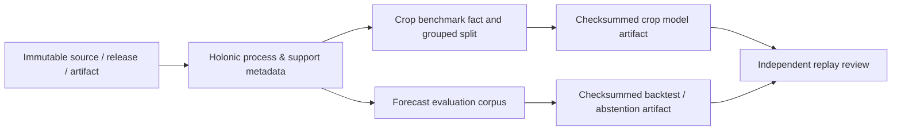

# Public model-delivery orchestration

## Decision and delivery boundary

This track delivers two independent, local, evaluation-only research artifacts:

1. a historical GHISACONUS crop-spectrum classifier; and
2. a regional NASA POWER seven-day meteorological backtest or a durable
   abstention report.

It does not deliver a property model, utility model, restoration recommendation,
strategy ranking, intervention effect, public forecast, or deployment. A future
water, energy, vegetation, soil, yield/cost, biodiversity, or scenario model
must start with its own retained source, target definition, availability clock,
support declaration, and validation plan.

## Immutable inputs

| Lane | Bound input | Required re-verification |
| --- | --- | --- |
| Crop benchmark | Kaggle GHISACONUS Version 1 CSV: 6,988 historical signatures, 131 spectral bands, 99 `Image` groups | Receipt `../restoration_ag_demo_20260726/receipts/kaggle-ghisaconus-v1.json`; CSV SHA-256 `e2f5a21b24fac00e930520ba959ab54cc8a3f8c56368f8e0a1868bbf3e3377d5` |
| Forecast backtest | Frozen NASA POWER export: 1,462 daily observations and 98 scored rows from 14 seven-day origins | `C:\tmp\plantgeo-frozen-forecast-20260726\manifest.json`; manifest SHA-256 `1bb6a6a707b432f2036edba86a426a32c1c04304b350af4caaec14a48cb20d09` |

A checksum, source/release, support, unit, or availability-clock mismatch stops
the affected lane. No artifact may consume an unretained substitute file.

## Modeling architecture

The source/release/artifact/process/support metadata remains the holonic
envelope. Analytical facts and dimensions use the projection-first Kimball
contract in [`docs/holonic-kimball-modeling.md`](../../../docs/holonic-kimball-modeling.md).
Raw observations are not copied into generic lineage tables. GHISACONUS uses a
typed crop-spectrum benchmark plane rather than forecast-only model relations;
the forecast lane uses existing compatible governed relations only when their
contract fits.

## Crop lane

`Crop` is the sole primary target. The 131 spectral bands are the primary
features. `Image` is the mandatory leakage-control group. Coordinates, AEZ,
stage, and calendar fields are excluded from primary features; they may appear
only in separately named diagnostic or shortcut experiments.

The lane must profile finite values, duplicates, image-to-crop cardinality, and
per-class independent-image support. It uses a deterministic approximately
60/20/20 `Image`-group train/validation/final allocation. A class that cannot
occupy each required independent partition is unsupported; it is never silently
merged or randomly split by row.

The candidate ladder is majority class, train-only standardized multinomial
ridge/logistic regression, then at most one bounded nonlinear classifier. Model
selection, calibration, abstention, preprocessing, and tuning use only training
and validation data. The untouched final-image evaluation is run once and
reports macro-F1, balanced accuracy, per-class metrics, confusion matrix,
calibration/selective-risk results, group-integrity proof, and every artifact
checksum.

## Forecast lane

The lane profiles the frozen source/export, confirms the fourteen seven-day
origins and their as-of availability, and evaluates persistence and
seasonal-naive on identical expanding origins. A regularized lag/calendar
candidate may be considered only when its imputation, scaling, seasonal basis,
and selection are fit inside each training fold.

It reports MAE, RMSE, bias, valid MAPE, skill versus persistence, interval
coverage, horizon slices, and season slices. The current corpus is explicitly
insufficient for a 30-day seasonal-selection claim: it must not create a longer
horizon, treat overlapping windows as independent, or claim a selected seasonal
forecast model. Its valid delivery is a checksummed seven-day contextual
backtest or a checksummed abstention.

## Common acceptance and stop conditions

Each lane stops on its own checksum, lineage, leakage, calibration, support,
or holdout-integrity failure. An independent verifier replays hashes, inputs,
split/clock integrity, claims, and final metric tables from a clean environment.
Only separately approved, additive migrations may persist normalized facts,
model runs, predictions, and evaluation receipts. Existing release records,
source observations, publication views, Railway services, and
`effect_candidate` remain untouched.
