# Data Ingestion and Serving Contract

**Status:** enforced phase-one boundary with an implementation backlog. Environmental
read paths now use database publications or report `unavailable`; the inventory below
records what still needs an ingestor or an approved static-asset/imagery exception.

## Governing rule

Environmental or ecological facts displayed by PlantGeo must first pass a controlled acquisition/ETL path, be validated, normalized, versioned, and be published to the platform PostgreSQL database. Phase-one training, forecasting, inference, long preaggregations, and bulk backfills run on the operator-controlled local machine; Railway receives validated publications and serves them. A bounded authenticated server refresh may fetch an operational source only when it persists the validated observation before display. The browser reads only PlantGeo-owned APIs, tiles, streams, or object-storage URLs. Provider credentials, provider-specific schemas, and upstream retry behavior never belong in the Next.js client.

For the first production phase, one PostgreSQL/PostGIS database is both the operational store and analytical warehouse. Workloads remain isolated by schema, role, views, connection pools, and statement limits so they can be split later without changing public contracts:

- existing application tables remain under the Drizzle migration authority;
- environmental observations, features, forecasts, model outputs, job state, and serving views live in `agri` under Alembic authority;
- Next.js and Martin receive read-only access to explicitly published `agri` views;
- the bounded publication API receives only the grants required to stage, validate, and atomically publish local outputs; local ETL/training processes do not receive application-schema DDL authority.

The target Railway steady state is the application/API, one PostGIS database,
Redis, and Martin. It has no long-running ETL, Monte Carlo, inference, or
training worker. Bounded authenticated acquisition handlers may persist current
observations, but Redis-backed background workers remain disabled. Local
manifests/checkpoints are authoritative until publication; PostgreSQL
publication lineage is authoritative afterward.

This is a custody rule, not a demand to place every byte in a relational column. Normalized records, provenance, checksums, spatial coverage, availability time, and artifact metadata are always in PostgreSQL. Large immutable rasters, source archives, PMTiles, imagery, and model binaries may live in Cloudflare R2 with a content-addressed URI recorded in PostgreSQL.

## Authoritative data path

```mermaid
flowchart LR
  upstream["External source"] --> ingest["Controlled ETL (local for batch/model work)"]
  ingest --> validate["Local validation and frozen manifest"]
  validate --> artifact["R2 immutable artifact when large"]
  validate --> publish["Bounded Railway publication API"]
  artifact --> publish
  publish --> warehouse["PostgreSQL normalized and versioned records"]
  warehouse --> transform["Validated publication pointer and read views"]
  transform --> api["Next.js read API or Martin MVT"]
  api --> worker["Browser or MapLibre Web Worker"]
  worker --> render["MapLibre / deck.gl render state"]
```



Each stage is independently replayable. An upstream response is not publishable merely because it returned HTTP 200: its source release, checksum, schema version, quality result, license, coverage, and `data_available_at` must be recorded. A failed refresh leaves the last valid release available with a visible stale timestamp; demo data must be labeled as demo and must never silently impersonate live data.

## Source classes and exceptions

| Class | Custody and serving policy |
| --- | --- |
| Environmental observations and derived facts | Persist normalized values and provenance in PostgreSQL before display. Serve published database views through PlantGeo APIs or Martin. |
| Large raster, imagery, and tile archives | Register metadata and checksum in PostgreSQL; retain the immutable artifact or approved derivative in R2; expose a first-party tile/CDN URL. Store extracted analytical features in PostgreSQL. |
| Model inputs and outputs | Pin an immutable release set and feature snapshot. Persist prediction, uncertainty, coverage, model version, and publication state in PostgreSQL. Store model binaries in R2. |
| User and action-network records | Persist transactionally in PostgreSQL. Publish bounded, permission-aware read models; never rely on a browser-only copy as the system of record. |
| Routing and geocoding requests | Photon and Valhalla are request processors rather than environmental source facts. Proxy through the server and use bounded, privacy-reviewed caches; do not warehouse precise user queries or routes by default. |
| Imagery requiring provider-side access control | Proxy metadata and authorization through the server. Cache or archive pixels only when the provider license permits it. Never ship a privileged token as `NEXT_PUBLIC_*`. |
| Basemap, terrain, glyph, and sprite assets | Prefer a version-pinned PlantGeo/R2 asset. A public third-party asset needs a documented availability, license, privacy, and failure-mode waiver. |
| Outbound email, webhook, commerce, and AI calls | Not ingestion sources. If their returned content is displayed as a platform fact, persist the versioned result and provenance before publication. |

Every exception is an entry in `data_source` with an owner, purpose, license, allowed client exposure, retention rule, review date, and fallback. An undocumented hostname is not an exception.

## Current migration inventory

The repository currently contains both browser-direct and request-time server integrations. This inventory sets the migration order; it does not assert that every upstream license permits mirroring.

| Current integration | Current path | Required target |
| --- | --- | --- |
| U.S. Drought Monitor | Server-side alert/context code accepts only a recent persisted weekly release. The public map fails closed because returning the national JSONB collection is not a bounded serving contract. | Add checkpointed ingestion, immutable source-release lineage, indexed geometry, and a versioned bbox/MVT publication with feature/byte limits and a freshness SLO. |
| USGS water | Scheduled/authorized ingestion persists bounded gauge features; display queries read the database and show unavailable when empty. | Move the ingestion adapter into the local Python runner and add source-release/version and coverage metadata. |
| Active fire detections | Authorized NASA FIRMS ingestion persists bounded detections; `/api/fires` and wildfire tRPC read the database only. | Move retrieval into checkpointed local ETL, add immutable release lineage, and retain the last valid publication on source failure. |
| Weather observations | The authorized ingestion endpoint validates Open-Meteo output and persists an observation before returning it. It is not yet a complete published time-series product. | Move retrieval to local ETL and publish normalized temperature, humidity, precipitation, wind, and observation-time records through the time-series contract. |
| NLCD, LANDFIRE, SoilGrids, vegetation, MTBS, Hydro services, and USDA soil | Operational display paths no longer call these providers. Environmental tiles fail closed; a configured hostname alone cannot mark a layer published. | Register licensed releases; ingest locally; store analytical summaries/crosswalks in PostgreSQL; mirror or derive licensed tiles and expose them only through a database-backed catalog containing immutable URL, release, checksum, coverage, and approval state. |
| Mapillary imagery | A same-origin server proxy holds the token and streams bounded tile responses; this is an imagery access exception, not an environmental-fact pipeline. | Complete the license/privacy/retention review, register the exception, and persist only metadata that the provider terms permit. |
| PMTiles, terrain, basemap styles, glyphs, and sprites | Mixed PlantGeo, S3, Protomaps, and other public URLs | Pin and mirror production assets to R2 where licensing permits; otherwise register an explicit static-asset waiver. |
| Photon and Valhalla | Server-proxied per-request services | Retain proxy pattern with privacy-safe bounded caching; exclude from environmental warehouse completeness metrics. |

## Database publication contract

Ingestion tables are never queried by a browser-facing route. Publication is an explicit transaction that advances a versioned read model only after validation succeeds. A serving row or tile feature includes, directly or by stable lookup:

- `data_revision`, `release_set_id`, `published_at`, and `data_available_at`;
- observation or forecast validity interval;
- source and transformation versions;
- coverage and quality state, including `insufficient_data`;
- geometry resolution and simplification level;
- public visibility and access constraints;
- an `ETag`-compatible revision identifier.

Small viewport responses may use GeoJSON. Dense geometry uses Martin-generated MVT from published PostGIS views. Large non-map feature batches should use a versioned binary or streaming contract after measurement; do not send continental GeoJSON merely to discard most of it in the browser. Read endpoints require a bounding box or stable region, resolution/zoom, `as_of`, filters, and a server-enforced feature/byte limit.

Suggested endpoint shape:

```text
GET /api/v1/environmental/{layer}?bbox=...&zoom=...&as_of=...&revision=...
GET /api/v1/opportunities?bbox=...&zoom=...&strategy=...&as_of=...
GET /tiles/{published_source}/{z}/{x}/{y}.mvt?revision=...
```

## Web Worker boundary

MapLibre already performs tile parsing and placement in its own workers. PlantGeo's custom action-network worker should complement that behavior for records feeding deck.gl or application-specific layers:

1. The main thread sends only viewport, zoom, filters, requested revision, and a monotonically increasing request ID.
2. The worker fetches a same-origin PlantGeo endpoint, validates the versioned response, filters/clusters/ranks features, and returns compact render data.
3. Typed arrays and binary buffers are transferred rather than cloned when payload size justifies it.
4. The main thread owns React state and MapLibre/deck.gl mutations. It ignores responses whose request ID or revision is stale.
5. Panning, filter changes, or unmount abort in-flight work. Worker failure degrades to a bounded server-aggregated response, not an unbounded main-thread calculation.

The action-network worker now performs same-origin bounded fetch, schema/version validation, cancellation, viewport clustering, stale-response suppression, and structured error reporting. The main-thread fallback is also byte- and feature-bounded. Typed-array transfer remains a measured follow-up once profiling shows that JSON parse/clone overhead is material. Do not introduce `SharedArrayBuffer` until a measured need justifies the required cross-origin isolation policy.

## Enforcement and operating gates

- The CI hostname gate is installed as `npm run check:data-boundary` and runs in the web CI job. It rejects unapproved provider URLs under client components, hooks, stores, workers, and browser-only libraries; first-party URLs and the reviewed static-asset allowlist remain explicit.
- Every displayed environmental layer maps to a registered source, ingestion definition, freshness SLA, validation suite, published view, and visible freshness/coverage state.
- Provider fetch code is server-only and must enforce timeouts, bounded retries, response-size limits, schema validation, and persistence-before-display. Bulk acquisition, backfills, training, forecasts, and long transforms belong in local Python modules. Railway handlers are limited to bounded current-observation acquisition and publication receipt; browser code never calls environmental providers.
- Client-facing queries use read-only database roles, bounding constraints, statement timeouts, rate limits, and cache keys containing the published revision.
- Phase-one training, forecasting, and long preaggregations run on the operator-controlled local machine against pinned exports. Publication uses a bounded authenticated API and cannot consume the operational read pool without explicit limits. PostgreSQL resource pressure, replica lag if added, and oldest publication age are alertable.
- Source payloads, logs, and error details are redacted before persistence. Precise user locations are not repurposed for model training without an explicit consent and governance policy.
- Legacy BullMQ modules remain disabled in web replicas (`ENABLE_LEGACY_BULLMQ_JOBS=false`). They use import-time workers and are not production-approved until converted to the PostgreSQL ledger, fenced leases, idempotent publication, and a dedicated singleton runner role.

## Migration sequence

1. Register every current upstream and complete its license, cadence, retention, and client-exposure review.
2. Establish Alembic-owned source/release/observation/artifact/job tables and a least-privilege publication role in the replacement database.
3. Implement checkpointed source-release ingestion for drought, fire, water, and weather first. Their display paths are already database-first or explicitly unavailable; the remaining work is immutable lineage, complete time-series normalization, freshness SLOs, and local bulk replay.
4. Add licensed raster/imagery mirroring or proxy policies, analytical cell crosswalks, and first-party tile endpoints.
5. Profile the bounded action-network worker and introduce transferable render buffers only when measurements justify the added binary contract.
6. Enable the CI hostname gate, then remove the temporary allowlist entry for each migrated source.
7. Split the warehouse from the operational database only when measured contention, recovery requirements, or independent scaling justify it. Preserve the same publication contracts during that move.

## Phase-one execution boundary

The always-on platform may acquire a narrowly bounded, current observation for an already governed source and persist it before any display. It must use a fixed viewport/time window, timeout, response-size cap, schema validation, idempotent source identity, and an explicit unavailable/stale result. It never runs a backfill, feature build, preaggregation, forecast, model training, or unbounded source crawl.

Operator-controlled local execution owns expensive or replayable work: capturing a pinned upstream release, validating it, bulk normalization, historical backfills, feature/preaggregation production, forecasts, and training/evaluation. The first implemented vertical slice is `agri-data-service source-ingest`: it accepts a reviewed sidecar plan and bounded GeoJSON capture, creates a local immutable checkpoint, and publishes one idempotent `data_source` → `source_release` → content-addressed `artifact` → validated `release_set` transaction. It records what was written, can be safely re-run after interruption, and deliberately does not promote any model, forecast, or waypoint output.

`source-ingest` is deliberately disabled until an operator explicitly provides `LOCAL_SOURCE_LOADER_DATABASE_URL` with an async PostgreSQL DSN for `plantgeo_loader` on the local Compose warehouse at `127.0.0.1:5442/plantgeo`. It rejects the `plantgeo_owner` bootstrap role and never inherits or falls back to `DATABASE_URL`, which prevents a local capture from silently writing to the application or production connection. After the reviewed migration and manual `infra/local-warehouse/create-loader-role.sql` gate, set that single loader variable through the operator environment or secret store, then run `uv run agri-cli source-ingest --plan <reviewed-plan.json> --payload <captured-release.geojson>` from `services/agri-data-service`.

The source-artifact custody policy is reject-only: before a payload checksum, local checkpoint, or database artifact exists, `source-ingest` walks the complete parsed GeoJSON with a 50,000-node and 32-level bound. It canonicalizes camelCase, hyphenated, and underscored field names; rejects explicit credential names and unambiguous credential suffixes anywhere in the document; and rejects Bearer/Basic authorization values rather than silently altering an immutable source file. A rejected payload produces no artifact suitable for a dump or promotion; a source requiring redaction must be transformed by a separately reviewed ingestion definition before this phase-one command is used.

## Acceptance criteria

- Disabling browser access to third-party provider hosts does not remove any production environmental layer.
- Replaying a pinned source release yields the same normalized checksum and published revision.
- A failed or late upstream refresh serves the previous valid release with an explicit stale state and raises an operational alert.
- A viewport change cancels obsolete worker work; stale responses cannot replace a newer map revision.
- No browser bundle contains a privileged upstream credential or an undocumented provider URL.
- Database load tests demonstrate that export and publication requests cannot exhaust the connection or query budget reserved for operational reads; no Railway long-running ETL, forecast, inference, or training queue exists in phase one.
