# PlantGeo Architecture Diagrams

Visual guide to PlantGeo's data flows and system architecture using Mermaid diagrams. Each diagram is kept small and focused — scroll down for higher-level rollup views.

---

## Table of Contents

- [1. High-Level System Overview](#1-high-level-system-overview)
- [2. Client Architecture](#2-client-architecture)
  - [2a. Map Rendering Pipeline](#2a-map-rendering-pipeline)
  - [2b. State Management Flow](#2b-state-management-flow)
  - [2c. Panel System](#2c-panel-system)
- [3. Server Architecture](#3-server-architecture)
  - [3a. Request Routing](#3a-request-routing)
  - [3b. tRPC Router Map](#3b-trpc-router-map)
  - [3c. Authentication Flow](#3c-authentication-flow)
- [4. Data Flows](#4-data-flows)
  - [4a. Map Tile Loading](#4a-map-tile-loading)
  - [4b. Environmental Data Query](#4b-environmental-data-query)
  - [4c. AI Regional Intelligence](#4c-ai-regional-intelligence)
  - [4d. Real-Time Streaming (SSE)](#4d-real-time-streaming-sse)
  - [4e. Fleet Tracking (WebSocket)](#4e-fleet-tracking-websocket)
  - [4f. Routing Query](#4f-routing-query)
  - [4g. Geocoding Search](#4g-geocoding-search)
- [5. Background Jobs](#5-background-jobs)
- [6. Database Schema (ERD)](#6-database-schema-erd)
  - [6a. Auth & Teams](#6a-auth--teams)
  - [6b. Geospatial Data](#6b-geospatial-data)
  - [6c. Environmental & Community](#6c-environmental--community)
  - [6d. AI Conversations](#6d-ai-conversations)
- [7. Deployment Architecture](#7-deployment-architecture)
- [8. Caching Strategy](#8-caching-strategy)
- [9. Rollup: Full Request Lifecycle](#9-rollup-full-request-lifecycle)

---

## 1. High-Level System Overview

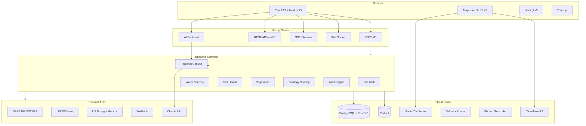

---

## 2. Client Architecture

### 2a. Map Rendering Pipeline

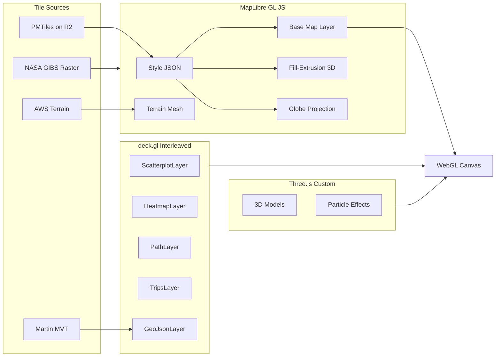

### 2b. State Management Flow

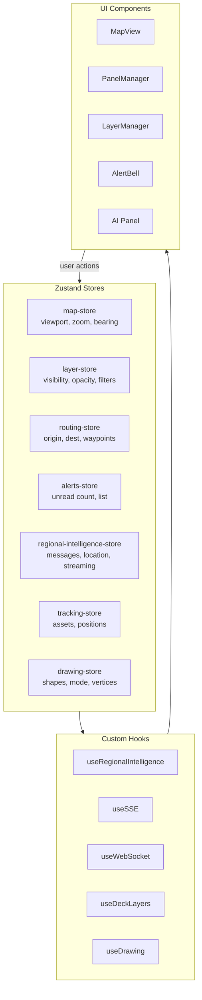

### 2c. Panel System

```mermaid
graph LR
    PM[PanelManager<br/>Toolbar] -->|click| Panels

    subgraph Panels["Side Panels"]
        FD[FireDashboard]
        WP[WaterPanel]
        VP[VegetationPanel]
        SP[SoilPanel]
        CP[CommunityPanel]
        StP[StrategyPanel]
        TD[TeamDashboard]
        AD[AnalyticsDashboard]
        RI[AI Intelligence Panel]
    end

    Panels -->|tRPC queries| API[tRPC Routers]
    RI -->|SSE stream| AIRoute[/api/ai/regional-intelligence]
```

---

## 3. Server Architecture

### 3a. Request Routing

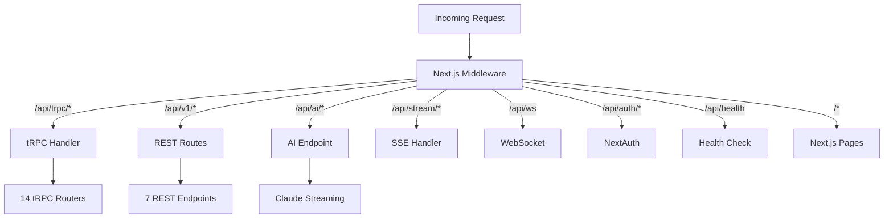

### 3b. tRPC Router Map

```mermaid
graph TD
    AppRouter[appRouter] --> layers & routing & teams & contributions
    AppRouter --> analytics & tracking & wildfire & visualization
    AppRouter --> places & environmental & community & strategy
    AppRouter --> alerts & regionalIntelligence

    subgraph "Public"
        layers[layers<br/>5 procedures]
        routing[routing<br/>4 procedures]
        places[places<br/>3 procedures]
        environmental[environmental<br/>11 procedures]
        visualization[visualization]
    end

    subgraph "Protected"
        teams[teams<br/>6 procedures]
        contributions[contributions]
        analytics[analytics<br/>5 procedures]
        tracking[tracking<br/>4 procedures]
        alerts[alerts<br/>5 procedures]
        regionalIntelligence[regionalIntel<br/>3 procedures]
    end

    subgraph "Contributor+"
        wildfire[wildfire<br/>3 procedures]
        community[community<br/>4 procedures]
        strategy[strategy<br/>4 procedures]
    end
```

### 3c. Authentication Flow

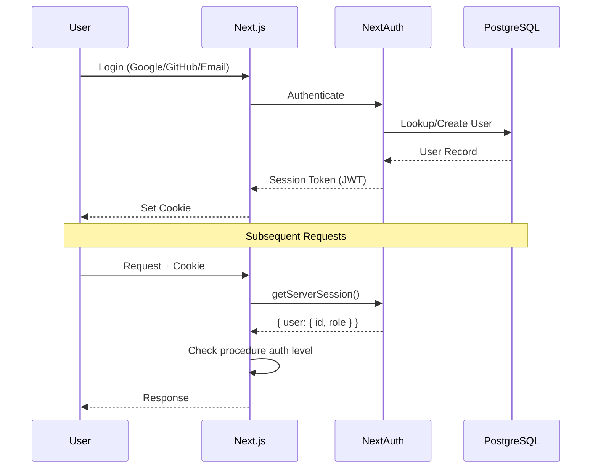

---

## 4. Data Flows

### 4a. Map Tile Loading

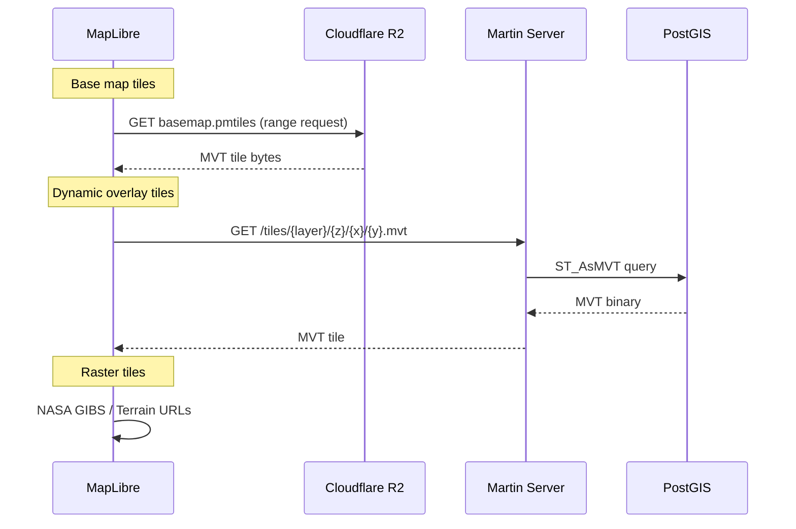

### 4b. Environmental Data Query

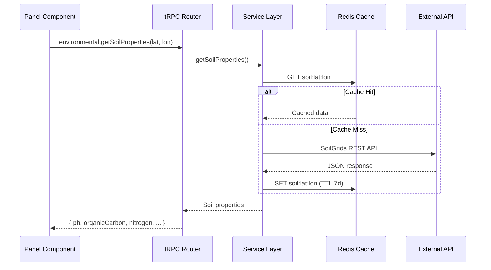

### 4c. AI Regional Intelligence

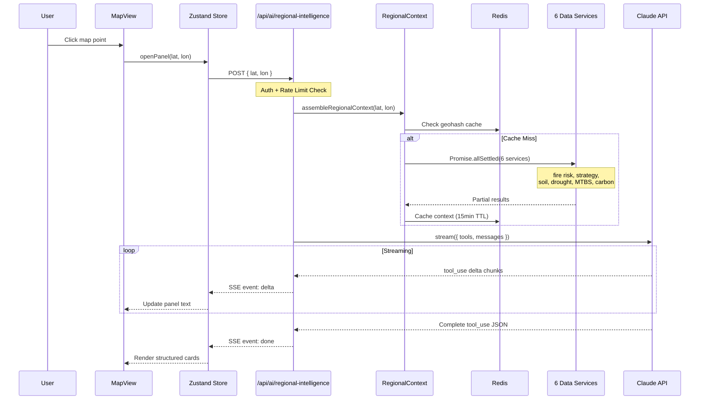

### 4d. Real-Time Streaming (SSE)

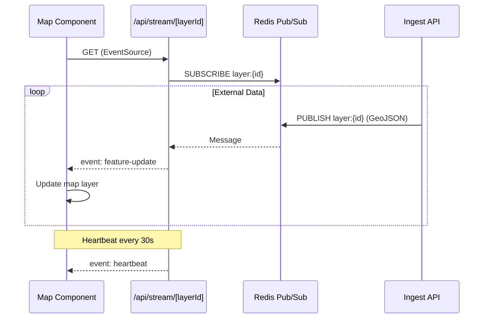

### 4e. Fleet Tracking (WebSocket)

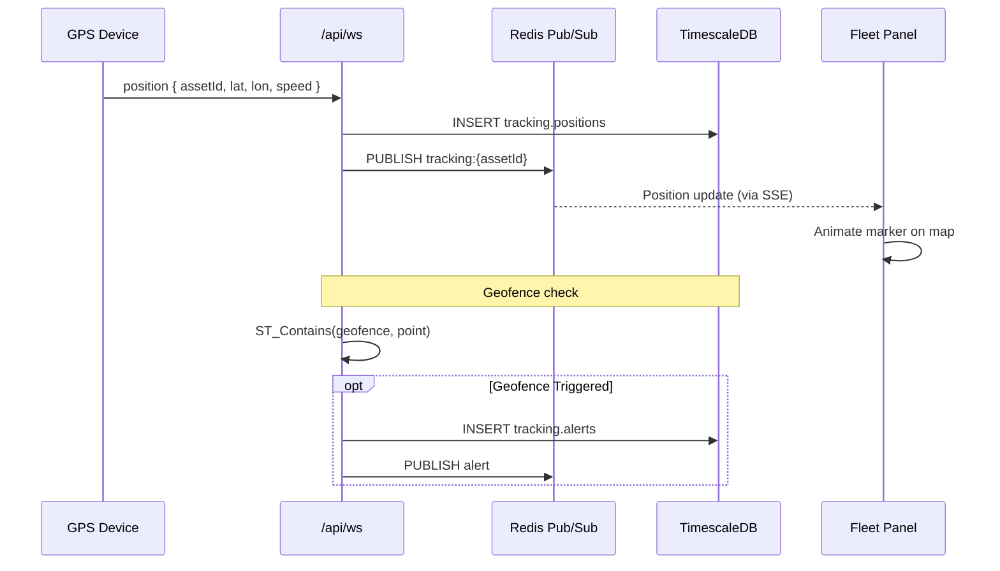

### 4f. Routing Query

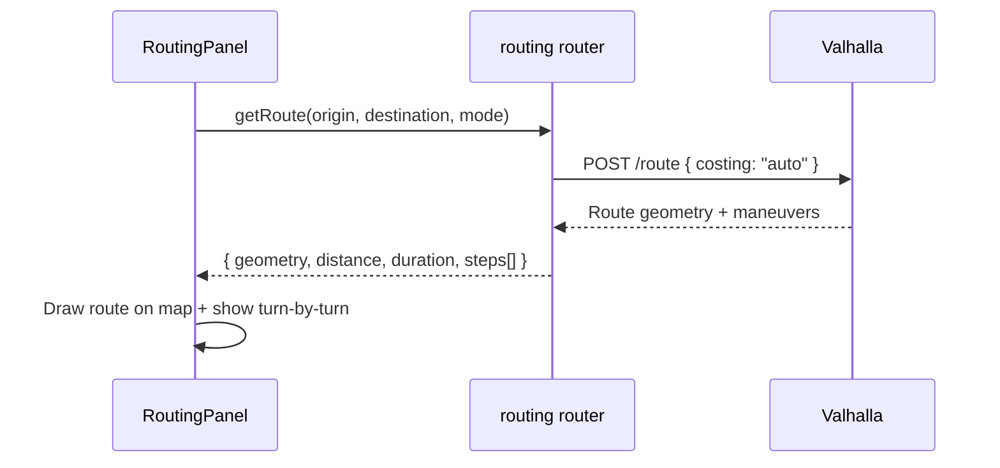

### 4g. Geocoding Search

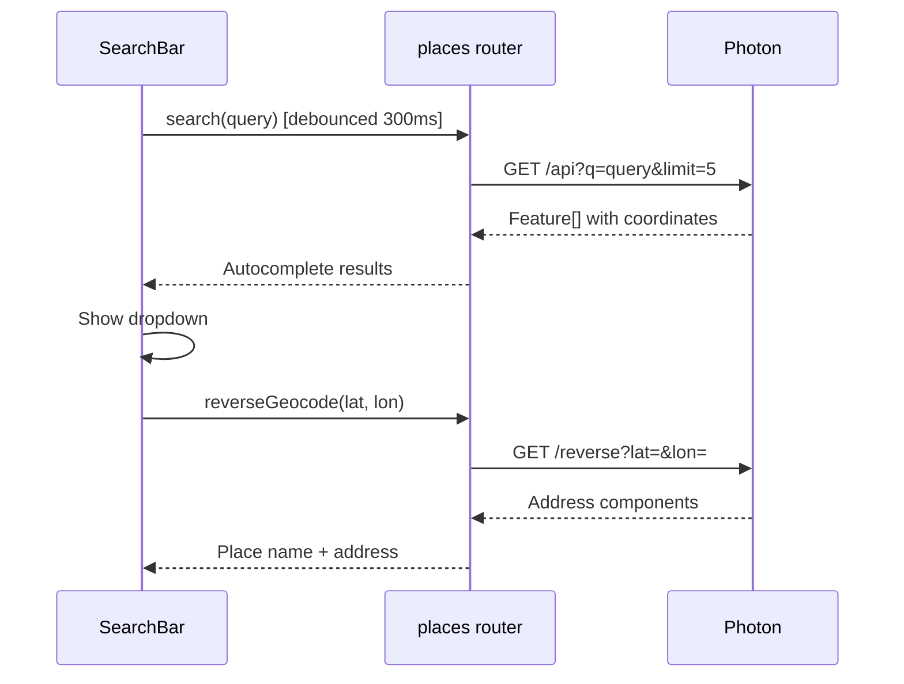

---

## 5. Background Jobs

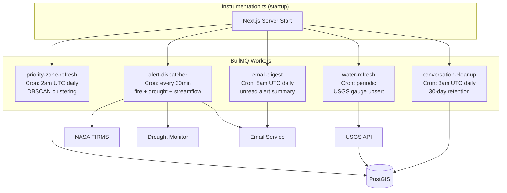

---

## 6. Database Schema (ERD)

### 6a. Auth & Teams

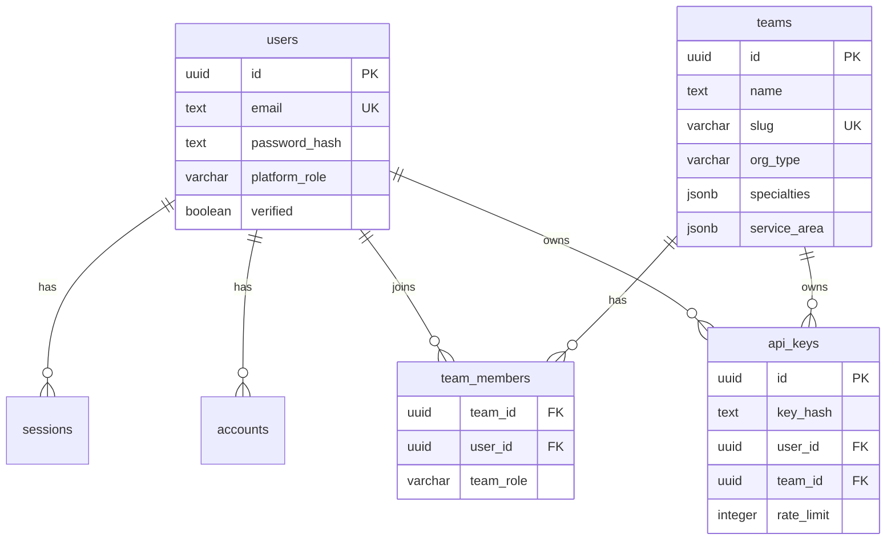

### 6b. Geospatial Data

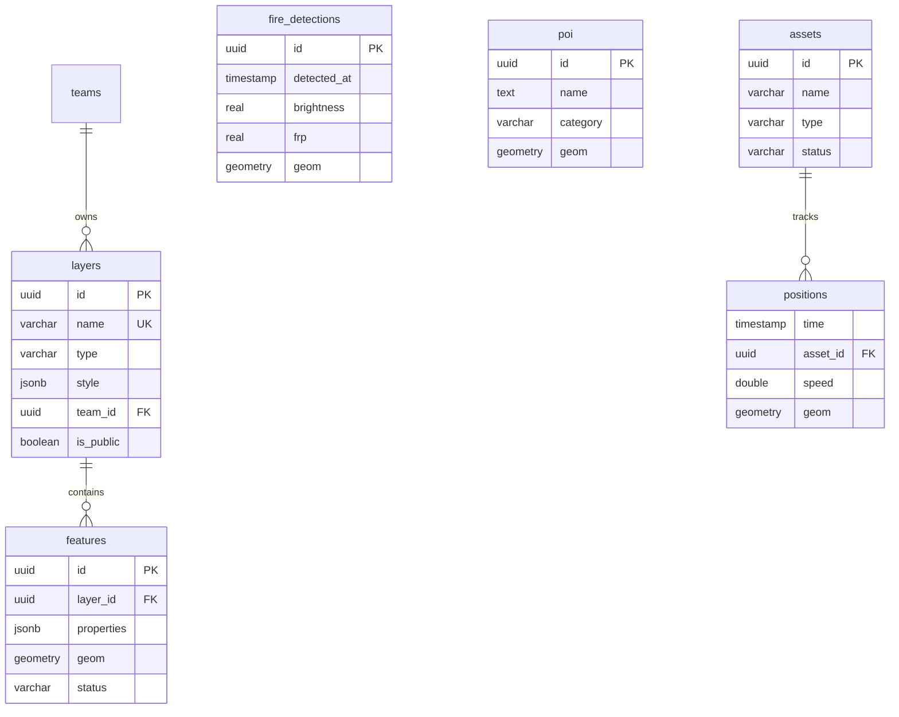

### 6c. Environmental & Community

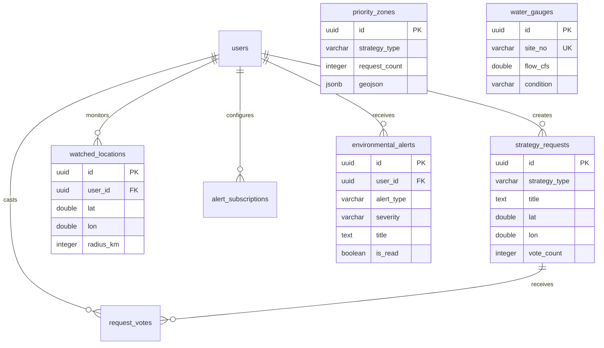

### 6d. AI Conversations

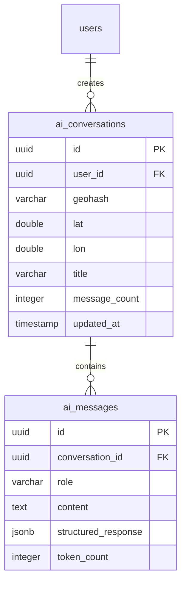

---

## 7. Deployment Architecture

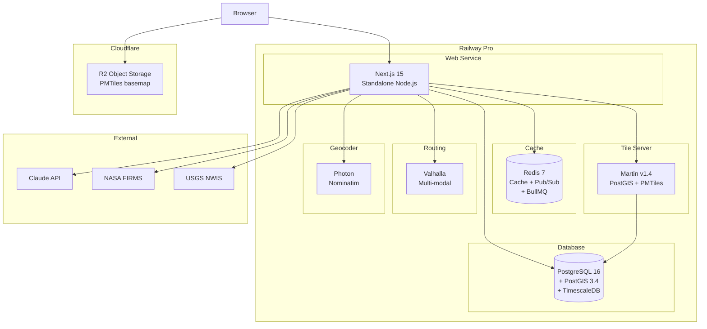

---

## 8. Caching Strategy

```mermaid
graph LR
    subgraph "Cache Tiers"
        direction TB
        L1["Browser Cache<br/>PMTiles range requests<br/>Static assets (immutable)"]
        L2["CDN Cache<br/>Cloudflare R2<br/>Tile responses"]
        L3["Redis Cache<br/>API responses<br/>Session data<br/>Rate limits"]
    end

    subgraph "TTLs by Data Type"
        direction TB
        T1["15 min<br/>AI context, location-context"]
        T2["30 min<br/>Fire detections"]
        T3["6 hours<br/>Drought data, USGS gauges"]
        T4["24 hours<br/>MTBS perimeters, LandFire"]
        T5["7 days<br/>SoilGrids, NDVI monthly"]
    end

    L1 --> L2 --> L3
```

---

## 9. Rollup: Full Request Lifecycle

This diagram shows the complete lifecycle of a user interaction from map click to rendered AI response.

```mermaid
graph TD
    Click[User Clicks Map] --> Store[Zustand Store<br/>openPanel]
    Store --> Auth{Authenticated?}
    Auth -->|No| Login[Redirect to Login]
    Auth -->|Yes| Rate{Rate Limit OK?}
    Rate -->|No| Error429[Show 429 Error]
    Rate -->|Yes| Cache{Context Cached?}

    Cache -->|Hit| Prompt[Build Prompt]
    Cache -->|Miss| Fetch[Parallel Fetch]

    subgraph Fetch["Promise.allSettled"]
        F1[Fire Risk + FWI]
        F2[Strategy Scores]
        F3[Soil Properties]
        F4[Drought + Gauges]
        F5[MTBS Perimeters]
        F6[Carbon Potential]
    end

    Fetch --> CacheWrite[Write Redis<br/>15min TTL]
    CacheWrite --> Prompt

    Prompt --> Claude[Claude API<br/>tool_use stream]
    Claude --> SSE[SSE Events]

    subgraph SSE["Streaming Response"]
        E1[event: context]
        E2[event: delta ...]
        E3[event: done]
    end

    SSE --> Panel[RegionalIntelligencePanel]

    subgraph Panel["Rendered Output"]
        P1[Risk Summary Card]
        P2[Historical Events]
        P3[Actionable Items]
        P4[Intervention Cards]
        P5[Data Freshness]
    end

    Panel --> Persist[Save to DB<br/>ai_conversations]
    Panel --> FollowUp[Follow-up Chat Input]
    FollowUp --> Prompt
```

---

## Diagram Legend

| Symbol | Meaning |
|--------|---------|
| Rectangle | Process or component |
| Cylinder | Database or persistent store |
| Diamond | Decision point |
| Arrows | Data flow direction |
| Dashed box | Logical grouping |
| `PK` / `FK` / `UK` | Primary key / Foreign key / Unique key |
