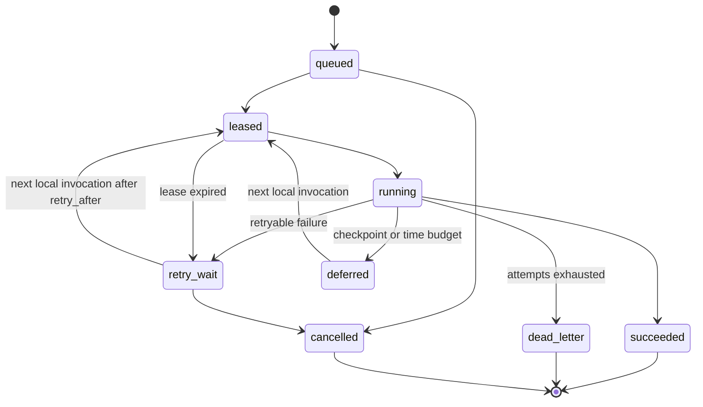

# Predictive Environmental Intelligence Specification

> **STATUS — 2026-08-22, body below untouched.** ML is frozen
> (`conductor/RUNBOOK.md` §0.24.5 — moving to
> `services/agri-data-service/src/agri_data_service/ml/` and eventually a
> separate Mojo service), and this spec's platform topology — "PlantGeo's single
> PostGIS database" — is being retired by the same pivot (§0.23/§0.24): data
> planes move to Parquet on Railway object storage, Postgres is community
> features only. The product definitions and safety gates below are not
> necessarily wrong, but the compute/serving topology they assume is superseded.
> Read RUNBOOK §0.23/§0.24 before building against the "Platform topology"
> section.

**Status:** proposed architecture and safety gates; no models or production recommendations are enabled by this document.

## Decision and safety boundary

PlantGeo will produce three decision-support products for a 30-day horizon:

1. Calibrated future-danger probability by grid cell and day.
2. Expected improvement from agriculture, agroforestry, reforestation, and silvopasture where the historical data supports a causal estimate.
3. Soil-amendment and planting eligibility for a crop/system matrix, conditioned on an observed soil test and local constraints.

These products feed a fourth, derived decision surface: ranked opportunity waypoints showing where a reviewed action could have high leverage. A waypoint is produced by a deterministic, versioned policy over model outputs, access evidence, feasibility, urgency, equity, uncertainty, and safety constraints. It is not a fourth predictive model and it is never permission to enter land or perform work.

No product may present a rate prescription, guarantee an outcome, or initiate field work. Each record must expose its data freshness, source versions, spatial resolution, uncertainty, model run, and an explanation of missing inputs. An unvalidated strategy result is a feasibility screen, not an effect claim. Amendment outputs require a current soil or tissue test, method and units, and local agronomy review before a rate can be displayed.

## Platform topology

Use the existing Python project through two entry points: an operator-controlled local CLI for ETL/model compute and a bounded Railway publication API connected to PlantGeo's single PostGIS database. The local CLI holds an upload credential, not a production database writer DSN. The API writes only the isolated `agri` schema. Bind all SQLAlchemy models to `agri`, make Alembic the sole migration authority for that schema, provision an `agri`-only publisher role, and production-disable `drop_all`, `create_all`, and extension DDL from application/reset commands. Drizzle must not migrate or reset `agri`. The web application consumes published read models only; it must never assemble features or train a model during a user request.

```mermaid
flowchart LR
  sources["Versioned open-data sources"] --> localetl["checkpointed local ETL"]
  localetl --> ingestapi["bounded publication API"]
  ingestapi --> raw["agri.signal_observation"]
  raw --> contract["v_signal_timeseries_contract"]
  contract --> preagg["daily and rolling feature materializations"]
  preagg --> export["pinned local feature export"]
  export --> mc["local set-based 30-day Monte Carlo baseline"]
  export --> train["local Python feature snapshots and model training"]
  mc --> outputs["predictions, effects, and eligibility"]
  train --> outputs
  lookup["Evidence-governed lookup tables"] --> outputs
  outputs --> etl["bounded validated publication API"]
  etl --> waypoint["access-gated opportunity policy"]
  waypoint --> publish["versioned database serving views"]
  publish --> api["PlantGeo API or Martin MVT"]
  api --> worker["MapLibre or application Web Worker"]
  worker --> map["review and action-network UI"]
```



This diagram is the target flow. The implemented phase-one path currently stops
at a validated `artifact_only` publication pointer. Revision `20260720_0002`
defines the typed historical observation and pinned-contract foundation, but it
is not yet applied or populated in the local warehouse; feature materializations,
model tables, and waypoint serving remain gated follow-up work.

All environmental facts displayed in the client follow the warehouse-first custody and Web Worker boundary in [Data Ingestion and Serving Contract](./data-ingestion-and-serving-contract.md). Normalized records and provenance live in PostgreSQL; large immutable source/model/tile artifacts may live in R2 behind database metadata. Browser code calls only PlantGeo-owned endpoints. Routing, geocoding, licensed imagery, and static basemap assets require explicit policies rather than silently bypassing this rule.

Revisions `20260722_0005` through `20260722_0008` define the additive SQL forecasting, local-training lineage, immutable publication, historical hindcast-signal, calibration-leakage, active-policy, calibration-sample, and versioned receipt contracts. They are applied to the isolated local warehouse. The first pinned NASA POWER evaluation was retained as a rejected v1 run with immutable forecast-versus-actual receipts; no operational forecast, ML result, or strategy-selection output was published. See [SQL-first forecasting framework](./sql-forecasting-framework.md).

Phase-one bulk ingestion/backfills, long preaggregation, Monte Carlo forecasting, inference, and model training execute on an operator-controlled local machine. Railway is primarily the serving and publication plane: it runs the application/API, the single operational PostGIS database, Redis, and Martin, and it receives bounded validated publications. Bounded authenticated acquisition handlers may retrieve a current observation only when they validate and persist it before display, but Railway does not run Celery, a scheduler, a long-running ingestion worker, or a model worker. The following are local commands, not Railway queues:

| Queue / command | Cadence | Responsibility |
| --- | --- | --- |
| `ingest` (local) | source-specific, manually or OS-scheduled | Retrieve, validate, normalize, version, and retain source observations in a checkpointed local run. |
| `preaggregate` (local) | after successful source batches | Build affected contract and rolling-feature shards from pinned inputs. |
| `forecast` (local) | manually started against a pinned export | Execute a future deterministic Monte Carlo implementation, checkpoint bounded shards, and produce validated artifacts. |
| `train` (local) | versioned and manually approved | Run future model implementations against immutable feature snapshots and register only validation-passing artifacts. |
| `infer` (local) | after a promoted model or forecast | Generate future result artifacts locally; no placeholder or fabricated prediction is allowed. |
| `publish` (local to API) | after local validation | Upload a frozen manifest and deterministic bounded result shards, then atomically register the complete artifact set. |
| `audit` (local/API) | at local start/end and on publication | Resume due local shards, verify publication completeness/freshness, and record a deduplicated incident when a run is late or incomplete. |

For the MVP, every model- or forecast-producing command stays local until measured reliability or latency justifies paid cloud compute. The next invocation reopens the deterministic manifest and completes only due or failed shards. Railway request handlers validate and atomically publish completed artifacts; any current-observation acquisition handler is bounded and persistence-first and may not assemble model features or execute model work. Redis carries cache invalidations and non-durable wake-ups only. `CELERY_DISPATCH_ENABLED` and `CLOUD_TRAINING_ENABLED` default to false and are rejected by the phase-one configuration.

### Phase-one local execution and ETL contract

`agri-cli local init` derives a UUIDv5 run ID and `logical_run_key` from the job/version, timezone-aware scheduled time, pinned release set, recipe/model version, and sorted target partitions. It creates `.agri-local-runs/<run-id>/manifest.json`; the same immutable inputs reopen the same run. `local checkpoint` writes an append-only, checksum-addressed cursor after each bounded shard, `local interrupt` records a clean stopping point, and `local resume` verifies and returns the latest cursor for a shard. These commands are execution infrastructure only: this phase does not yet implement or simulate any forecasting or training algorithm.

A local output cannot enter the manifest without `local register-output` and a machine-readable validation report whose status and every declared check are `passed`. Once `local publish` begins, checkpoints and outputs are frozen. Publication uses an explicitly configured HTTPS service URL and environment-only bearer token; there is no default credential and the API is disabled when the token is absent. Each request is independently retryable and idempotent, and the durable local cursor resumes at the first unacknowledged artifact after interruption.

Phase one caps each inline artifact at 5 MB, each run at 256 outputs, aggregate artifact bytes at 100 MB, and aggregate validation-report bytes at 10 MB by default. Request limits use the exact base64 expansion of both binary fields plus bounded JSON overhead. Larger results must be split into deterministic shards; raising a cap requires a database and request-size review. The API stores bounded content-addressed artifacts and the frozen manifest in PostgreSQL, records `job_run`/`job_output` lineage, and advances `publication_pointer` only after the exact declared set is validated. That pointer has `promotion_state=artifact_only`: it is an operational handoff, not permission for public forecast serving. A future typed loader must validate and transact rows into forecast/model tables before a serving view can expose them.

## Durable and lazily resumable execution

PostgreSQL is the source of truth for received artifacts and published releases. Before publication, the local manifest and append-only checkpoints are the durable source of truth for ETL and model compute. Phase one has no Celery dependency. Both sides use at-least-once attempts with idempotent effects: an interrupted local process, failed HTTP request, or Railway deploy must not duplicate a published release.

Each intended run has a deterministic `logical_run_key` derived from job definition, logical scheduled time, pinned input release set, recipe/model version, and target partition set. Local manifest uniqueness ensures that the next manual or OS-scheduled invocation reopens the same run rather than creating a duplicate. A run is divided into bounded `job_work_item` shards such as source page, spatial region, cell range, date window, or model fold. Completed shards are never recomputed simply because another shard failed.



Each local manifest/checkpoint mutation takes an OS-backed file lock, revalidates the manifest/directory identity, and uses an atomic replace. A future unattended multi-process runner must add a whole-run owner lease and fencing token before an OS schedule is enabled; the current CLI is operator-controlled and does not claim that lease exists. Long algorithm loops must check their wall-clock budget between partitions and persist a cursor before exit. The Railway publication API performs only bounded validation and short transactions; it never claims or executes local work.

Outputs are staged under deterministic uniqueness keys and immutable checksums. The first publication attempt freezes product, scope, and publisher in the local retry cursor. Publication is a short database transaction that revalidates the run and release, then advances a pointer from the previous validated output set to the new complete set; partial results are never exposed by modifying a live table in place. Version-keyed cache reads make a missed Redis invalidation safe, and the next publication/API audit can retry it. HTTP retries use bounded exponential backoff; invalid inputs and invariant failures stop for operator correction rather than being retried as transient failures.

## Data contracts and storage

All raw signals are append-only. Corrections create a new source version rather than overwriting the original payload. The mandatory provenance fields are: `source_id`, `source_version`, `retrieved_at`, `data_available_at`, `observed_at`, `valid_from`, `valid_to`, `license`, source query parameters, native geometry, spatial allocation/coverage, `spatial_resolution_m`, `temporal_resolution`, `quality_flag`, original and normalized values/units, `transform_version`, and a payload checksum. Record retractions and supersessions explicitly.

### Implemented foundation and planned schema

Revision `20260719_0001` currently creates the governed lookup/profile tables,
source and artifact lineage, release sets, and the durable execution/publication
ledger in `agri`:

| Table | Purpose |
| --- | --- |
| `locations`, `soil_profiles`, `climate_profiles`, `topography_profiles`, `water_profiles`, `land_use_snapshots` | Legacy profile-shaped records retained behind the Alembic boundary; they are not yet a normalized training contract or public location API. |
| `strategies`, `species`, `companion_relationships`, `knowledge_chunks` | Governed ecological lookup foundations. Draft records are not public model evidence; the API exposes only approved strategies. |
| `data_source`, `source_release`, `artifact`, `release_set`, `release_set_item` | Source license, citation, release/artifact checksum, and pinned release membership. |
| `job_definition`, `job_run`, `job_dependency` | Versioned schedules, deterministic logical runs, pinned inputs, dependency graph, policy, status, and aggregate progress. |
| `job_work_item`, `job_attempt`, `job_checkpoint` | Bounded resumable shards, lease/fencing ownership, immutable attempt history, cursor/checksum, retry timing, and progress. |
| `job_output`, `publication_pointer`, `job_outbox` | Immutable staged artifacts, atomic published-version pointer, and transactional delivery of wake-ups/invalidations/notifications. |
| `job_event`, `job_incident` | Partitioned structured operational events and deduplicated alert lifecycle. Event detail is redacted and retained hot for 30 days. |

The predictive/time-series schema is defined in the forward-only
`20260720_0002` migration, following the `20260719_0001` foundation. It remains
not production-readable until the operator applies it, validates a complete
historical release set, and promotes a reviewed typed publication:

| Planned table or view | Purpose |
| --- | --- |
| `spatial_cell`, `cell_source_crosswalk` | Stable analysis cells (`cell_id`, geometry, resolution, parent cell) and source-to-cell allocation/coverage. Begin with a 5–10 km grid; retain original source geometry separately. |
| `signal_observation` | Long-format observed/reanalysis signal: cell, native geometry, time, signal name, original/normalized value and units, depth/support, quality, availability time and source release. Partition by `observed_at` using PostgreSQL native partitions (formerly could use TimescaleDB hypertables until 2026-08-25). |
| `soil_profile_snapshot` | Point/AOI soil-test or modeled depth-band properties, method, units, lab/source and uncertainty. |
| `feature_definition`, `feature_snapshot` | Immutable feature recipe and a reproducible time/cell/model training snapshot. |
| `forecast_run`, `forecast_distribution` | Seed, horizon, input release set, baseline version, day/cell mean/median/p10/p90 and coverage. |
| `model_registry`, `model_run`, `model_metric` | Artifact URI/checksum, feature snapshot, temporal/spatial holdout metrics, calibration and promotion status. |
| `danger_prediction`, `strategy_effect` | Published, versioned outputs with confidence and explanation fields. |
| `opportunity_candidate`, `opportunity_waypoint`, `waypoint_access_review` | Policy-ranked intervention candidates, public/permission/safety review, destination geometry, expiry, evidence, and publication state. |
| `plant_taxon`, `plant_system_profile`, `environmental_constraint` | Taxonomy, system role and machine-readable temperature, moisture, pH, light, zone and spacing constraints. |
| `amendment_catalog`, `amendment_rule`, `amendment_eligibility` | Material properties, soil-test preconditions, safety/standards citations, and review status. |
| `companion_relationship`, `strategy_guide`, `evidence_source` | Evidence-grade relationships and restorative-agriculture guidance, each tied to a stable citation/version. |

`agri.job_event` is maintained by the local control-plane command `uv run
agri-cli job-logs-maintain --retention-days 30 --future-days 7`. It creates UTC
daily partitions across the complete hot window, moves recoverable rows out of
the default partition, and drops only date-named partitions older than 30 days.
Run it at least daily and alert on failure or a nonzero default-row count. This
database maintenance operation does not run forecasts or training on Railway.

Use PostGIS geometry for cells/AOIs and a composite index on `(cell_id, observed_at, signal_name)`. Use PostgreSQL native range partitions (monthly, by `observed_at`) behind the same contract view. TimescaleDB was removed on 2026-08-25, so do not reference hypertable-only features.

### Canonical time-series contract view

`agri.v_signal_timeseries_contract(as_of_time, release_set_id)` is the only
input to feature engineering once the historical plane is live. It selects a
pinned approved release set available at `as_of_time`, exposes provenance, and
never interpolates silently. Until a typed artifact loader and historical
promotion receiver exist, publication pointers remain `artifact_only` and no
forecast/model result is served. A convenience current view may exist for
browsing, but training, forecasts, and backtests must call the pinned contract
so later source revisions cannot leak into historical features. It normalizes
these initial signals:

| Signal family | Required fields | Initial source policy |
| --- | --- | --- |
| Drought impact | weekly USDM class, impacts, issue date | United States only; treat as weekly expert-analysis covariate/label. |
| Meteorology | temperature min/max/mean, RH/dew point, precipitation, wind, radiation | NASA POWER for initial daily coverage; grid-cell request caching. |
| Land-state history | layered soil moisture/temp, evapotranspiration, runoff, vegetation variables | ERA5-Land for retrospective training, with product/release latency recorded. |
| Vegetation/fuel context | NDVI/EVI anomaly, land-cover change, vegetation/fuel type | Versioned remote sensing plus NLCD/LANDFIRE. Do not substitute static land cover for vegetation condition. |
| Local soil | pH, texture, SOC, CEC, N/P/K where available, depth, method | U.S. SSURGO/SDA primary in the U.S.; SoilGrids global fallback with prediction interval. |
| Ground truth | fire perimeter/detection, drought impact, intervention record, outcome survey | Require explicit spatial/time joins, quality and legal-use review. |

The view must return original and normalized values/units, `quality_flag`, `coverage_fraction`, `source_release_id`, `data_available_at`, native geometry/crosswalk metadata, and `is_observed` for every row. A feature window with insufficient coverage produces `NULL` plus a missingness feature; it must not be back-filled with fabricated values.

## Planned SQL preaggregation and 30-day baseline

Use versioned daily and rolling aggregate tables populated by idempotent range upserts; do not call an ordinary PostgreSQL materialized view “incremental,” because `REFRESH MATERIALIZED VIEW` recomputes the whole object. If a Timescale continuous aggregate is available and verified in the deployment image, it may replace an aggregate table behind the same read contract. Daily features aggregate the contract into per-cell values and coverage counts. Rolling features add 1/7/14/30-day means, maxima, slopes, precipitation deficits, vapor-pressure deficit, soil-moisture percentile/anomaly, vegetation anomaly, land-cover/fuel class and data-age features. Rebuild the longest lookback plus the late-arrival/revision horizon for each changed input range.

The first implemented forecast should be SQL-based and reproducible rather than a hidden ML model. For each cell/day and `forecast_run`, generate a fixed number of residual draws with `generate_series`. Derive two independent uniforms from separately salted stable hashes and use the Box–Muller transform; clamp away from zero/one and record the seed, distribution family, parameter bounds and any approved correlation structure. Combine seasonal baseline, observed trend and residual scale estimated from the same feature snapshot and availability cutoff. Cap cell-days and draws per run, enforce a query timeout, and mark the run partial rather than silently omit failed partitions. Persist aggregates only:

- `mean` for expected value;
- `median` (`p50`) for robust central estimate;
- `p10`, `p90`, sample count and input coverage.

The query uses set-based `generate_series(1, 30)` × draws, window statistics and `percentile_cont`, never PL/pgSQL loops. A forecast is invalid when its coverage or residual-history threshold is not met.

## Model contracts

### 1. Future danger-zone model

**Outcome:** probability that a cell exceeds an explicitly versioned 30-day danger event definition. Start with separately reported fire-event and drought-escalation targets rather than an opaque composite. Fire detections/perimeters and USDM classifications are imperfect observations, not interchangeable ground truth: define event windows, no-event eligibility, spatial joins, and label exclusions in the label release.

**Candidate features:** rolling climate/soil-moisture/vegetation anomalies; land cover and fuel context; terrain; seasonality; recent fire/drought history; source age and missingness. Do not include any feature that is only known after the target horizon.

**Evaluation:** rolling-origin temporal splits plus spatial block holdout; probability calibration (Brier score, reliability curves), PR-AUC for rare events, recall at operational alert budget, coverage and subgroup geography checks. Evaluate a persistence/climatology baseline, track source and model drift, and publish a model card with label policy, data cutoff, calibration interval method and limitations. A model can publish only when it outperforms the SQL baseline and has calibrated confidence on a held-out recent season.

**Output:** `danger_probability`, class, calibrated uncertainty interval, feature/data freshness, model/run IDs and a concise factor explanation. It must say `insufficient_data` rather than paint a low-risk zone when input coverage is poor.

### 2. Intervention effect model

**Outcome:** estimated change in a pre-registered future-state metric (for example, danger probability, soil-moisture anomaly or vegetation anomaly) from a recorded intervention versus a comparable untreated area.

This is a causal/uplift problem, not a multiclass “best strategy” classifier. It requires intervention geometry, start/end dates, intensity/management attributes, baseline covariates, outcome windows and comparable controls. Use spatial/temporal matching plus doubly robust estimation or a causal forest only after overlap, balance and placebo checks pass. Until sufficient treated/control history exists, expose only `strategy_feasibility` from documented constraints; do not label it predicted improvement.

**Output:** one record per strategy with expected effect, confidence interval, support/overlap score, outcome definition, evidence tier and no-effect/insufficient-evidence state.

The implemented training and promotion contract, including the matched DiD,
cross-fitted AIPW, doubly robust learner, sensitivity model, and mandatory
abstention gates, is specified in
[strategy-selection-training.md](strategy-selection-training.md).

### 3. Plant-system and soil-amendment recommender

The v1 product is a versioned rules/constraint engine, not an ML rate recommender. It intersects crop/system profiles with local climate, water, pH, texture, organic matter, CEC, salinity and documented soil-test values. It returns eligible plants, constraints, companion relationships with evidence grades, and amendment eligibility. It does not infer nutrient deficiency or application rate from a modeled soil map alone. An amendment rule must identify the lab method, units, product contaminants/salts where relevant, jurisdiction/standard version, and a human agronomy review state.

Move to a learned recommender only after curated outcome records include cultivar, management, amendment product/rate, soil-test before/after, crop response, location, season and reviewer sign-off. Stratify by garden, silvopasture, agroforestry, reforestation and conventional/agricultural system to avoid false transfer across systems.

## Opportunity candidates and access-controlled action waypoints

Never convert a 5–10 km model-cell centroid directly into a destination. The first output stage, `opportunity_candidate`, is an analytical polygon or cell for monitoring, project planning, or possible field action. It records the prediction/forecast/release IDs, strategy, target metric, horizon, conservative expected benefit and interval, support/coverage, evidence tier, feasibility state, urgency, constraints, data cutoff, score components, ranking scope, policy version, and candidate/reviewed/rejected/expired state.

The second stage, `opportunity_waypoint`, exists only after review. It references a candidate and records a reviewed site point, a generalized point, precision radius, private/partner/permissioned access class, landowner/project permission state, ecological sensitivity, field-safety state, access window, reviewer, expiry, and withdrawal reason. Exact coordinates for private, sensitive, unsafe, or permission-pending sites are never available outside the authorized partner API or tile role. Unknown access remains planning-only.

`agri.v_public_opportunity_waypoint` is a planned publication-model name, not an active anonymous endpoint. Any eventual action-network serving view must select a current published release with verified partner access, completed ecological/safety review, a currently safe access window, non-expired validity, and non-sensitive generalized geometry. A private opportunity may instead expose an approved staging/contact point to a named partner workspace when the project owner explicitly approves it. High-danger cells can produce monitoring or planning candidates, but they cannot invite field access outside approved partner workflows during a fire, closure, severe-weather, or other unsafe window.

Ranking is deterministic, regional, auditable, and policy-versioned. A starting form is:

```text
leverage = conservative_expected_benefit
         × addressable_area
         × persistence
         × feasibility
         × urgency
         × approved_equity_weight
         × access_factor
         - uncertainty_penalty
         - effort_cost_penalty
         - safety_sensitivity_penalty
```

Use the lower confidence bound rather than the point estimate when ranking actions. Every component, normalization cohort, exclusion, weight, and rank is stored. Before the causal gate for the intervention model passes, results are labeled `feasibility_candidate`; the UI must not call them highest-leverage effects. The policy should diversify results across geography and strategy so a dense, well-instrumented region does not crowd out all other locations merely because it has more data.

A route or itinerary is a separate optimization over already-publishable waypoints. Valhalla may group destinations under user-supplied travel time, accessibility, capacity, and date constraints, but it cannot relax access or safety filters. Responses include `why_here`, expected benefit with uncertainty and units, evidence tier, freshness, access/permission state, recommended contact or next step, and an expiry time. They are invitations to coordinate and review—not field orders.

## Operational alerts and 30-day logs

Operational job incidents are private and separate from public fire, drought, or community alerts. The local runner evaluates the policy at startup, after each shard, and before exit; the publication API evaluates publication-specific failures on each request. Railway-native service and usage alerts cover the serving plane. These paths open or update a deduplicated `job_incident` for:

- a local-run heartbeat or expected publication past its SLO;
- oldest due item beyond its job SLO or excessive retry backlog;
- repeated stale local-lease recovery or Redis unavailability;
- terminal, quarantined, or incomplete publication work;
- source freshness beyond cadence plus its grace interval;
- no successful forecast publication within 36 hours;
- model evaluation, registration, or promotion failure;
- PostgreSQL connectivity, connection-pool exhaustion, storage, memory, or query-latency pressure;
- notification outbox delivery failure and cost-budget threshold crossings.

Incidents have a stable fingerprint, severity, first/last seen, occurrence count, cooldown, owner, acknowledgement, resolution, and reopen state. One failing shard must not emit one message per retry. Initial delivery can use email and a generic signed webhook from the local audit command; Slack or another incident platform is an optional adapter. Failed notification delivery is checkpointed and retried on the next local run. If alerts must fire while the operator machine is offline, that requirement explicitly introduces an external monitor or Railway scheduled service and its cost must be added before launch.

Emit single-line JSON stdout with timestamp, environment, service, job/run/work-item/attempt IDs, trace ID, event code, severity, duration, progress counters, lease age, retry class, and a redacted summary. Do not log raw source payloads, provider credentials, soil-test personal data, restricted waypoint geometry, or individual Monte Carlo draws/cells. Railway Pro's native 30-day application-log history satisfies the requested development window, while `job_event` gives database-queryable operational history. Partition `job_event` by time and drop partitions older than 30 days. Keep job identity, input/output lineage, model cards, metrics, incident summaries, and publication audit for the life of the published product; the 30-day rule applies to verbose development and operational events.

Use Railway soft usage alerts as early warnings. A hard usage limit takes workloads offline, so set it only above the selected operating envelope and ensure the stale-data behavior remains safe. The initial alert policy should warn near 70%, 85%, and 100% of the monthly budget, then require an explicit decision before applying a hard stop.

## Production cost envelope

This July 2026 planning estimate assumes local CPU-only tabular/geospatial model compute, Railway Pro for operational services, and standard Cloudflare R2 storage. Railway currently charges $20/vCPU-month, $10/GB-month RAM, $0.15/GB-month volume storage, and $0.05/GB service egress. The Pro plan is a $20 monthly minimum including the first $20 of usage, not an additional fee once usage exceeds $20. R2 standard storage is $0.015/GB-month, direct egress is free, and operation charges apply after the free tier. Recalculate this table against current pricing before launch.

| Monthly cost | Lean regional pilot | Base production | Growth / multi-region |
| --- | ---: | ---: | ---: |
| Railway app/API, Postgres, Redis, and Martin | $39 | $103 | $329 |
| PostgreSQL/Redis volumes | $4 | $24 | $158 |
| Railway API/dynamic-tile egress | $1 | $10 | $102 |
| Railway ETL/forecast/training workers | $0 | $0 | $0 |
| Cloudflare R2 storage/operations | $1 | $15 | $199 |
| **Estimated steady-state total** | **about $45/month** | **about $152/month** | **about $788/month** |
| **Planning range** | **$35–65** | **$115–210** | **$550–1,100** |

Assumptions:

- **Idle floor:** Railway Pro has a contractual $20/month minimum. Railway volumes are billed on actual stored bytes rather than configured capacity. The July 2026 snapshot showed about 1.1 GB in `Plantgeo`, 1.9 GB in `plantgeo-Redis`, and only a few MB in the replacement database, so current volume cost contributes less than $1/month. For the target five-service footprint—Next.js, bounded publication API, Martin, Postgres, and Redis—roughly 2.0–2.5 GB of resident memory plus minimal CPU produces a more realistic operational idle floor of about $27–35/month before R2 and traffic. Measure live usage again before launch.
- **Lean:** one region and one replica per service; about 0.75 GB/0.10 average vCPU for the app, 0.35/0.03 for the API, 0.35/0.05 for Martin, 1.5/0.15 for Postgres, and 0.25/0.02 for Redis; 25 GB Railway egress; and 100 GB R2. Roughly six local CPU training hours do not appear on the Railway bill.
- **Base:** coarse CONUS coverage; 1.5 GB/0.30 average vCPU for the app, 0.75/0.10 for the API, 0.75/0.20 for Martin, 4/0.60 for Postgres, and 0.75/0.08 for Redis; 200 GB Railway egress; 500 GB R2; and about 30 million monthly tile-object reads. Local weekly training totals about 24 hours.
- **Growth:** multi-region/million-cell operation with replicated public services; about 4 GB/1.0 aggregate app usage, 2/0.40 API, 2/0.80 Martin, 12/3.0 Postgres, and 2/0.25 Redis; 2 TB Railway egress; 5 TB R2; and about 300 million object reads. Local training totals about 100 hours.

The Railway worker line is zero because phase-one ETL and model compute are local; local electricity, hardware depreciation, local backups, and operator time are excluded. If cloud execution is reconsidered, burst cost can be recalculated as `vCPU_hours × $20 / 730 + GB_RAM_hours × $10 / 730`; an 8-vCPU/16-GB job is about $0.44 per active hour at current rates. Persistent PostgreSQL memory, publication writes, artifact storage, and tile traffic are expected to dominate Railway costs. GPU training, paid upstream APIs, Anthropic usage, email/incident providers, backup/export storage, and staffing are excluded. A separately resident Valhalla graph for waypoint itinerary planning may add roughly $25–105/month depending on coverage and memory.

The target steady state contains one PlantGeo database. `plantgeo-spatiotemporal-db` is the eventual replacement for `Plantgeo`, not an additive warehouse. During copy, verification, and rollback observation, both databases are billable. Budget the overlap as `overlap_days / 30 × (old_DB_GB_RAM × $10 + old_DB_average_vCPU × $20 + old_DB_volume_GB × $0.15)`. A two-to-four-week lean/base overlap is likely to add roughly $15–80, depending on the current database's measured footprint; a full month at growth size could add hundreds. Use private networking, record the cutover timestamp, and retire the old database only after backup, row/checksum, extension, migration, read/write, Martin, and rollback gates pass. The table above counts only the replacement database after cutover.

Monte Carlo is the largest algorithmic uncertainty. Its transient work grows as `cells × 30 forecast days × draws`: 100,000 cells with 250 draws produce 750 million transient rows per full forecast. Do not persist draws. The first production slice caps a run at roughly 5,000–10,000 changed cells, uses 50–100 validated draws, processes deterministic resumable chunks, and optionally runs higher-draw forecasting only on screened candidate areas. Runtime, rows generated, peak local memory, and cost per published cell are launch metrics. Durable checkpoints add little direct Railway cost; their main economic benefit is preserving completed local shards and avoiding repeat compute after interruption.

Pricing references: [Railway plans and resource rates](https://docs.railway.com/pricing/plans), [Railway logs](https://docs.railway.com/observability/logs), [Railway cron behavior](https://docs.railway.com/cron-jobs), and [Cloudflare R2 pricing](https://developers.cloudflare.com/r2/pricing/).

## Lookup and seed policy

Seed data must be migration-managed, idempotent and evidence-linked. A seed can introduce taxonomy, broad environmental limitations or an evidence-backed rule, but not a universal application rate.

| Lookup | Initial source | Seed payload | Guardrail |
| --- | --- | --- | --- |
| Plant taxonomy/distribution | USDA PLANTS | accepted name, taxon ID, common names, native/distribution metadata, citation | No cultivar-level performance claim without a source. |
| U.S. local soil context | NRCS SSURGO/SDA | map-unit/property/interpretation references and version | Prefer AOI-specific results; annual refresh versioning. |
| Global soil fallback | SoilGrids | depth-band property plus p05/p50/p95/uncertainty and CC BY attribution | Never convert a prediction to a soil-test result. |
| Strategy guidance | USDA Forest Service/NRCS and peer-reviewed evidence | strategy, system, conditions, intended outcome, evidence grade | Separate applicability from measured effect. |
| Amendment standards | USDA/NRCS and reviewed local extension guidance | test method/unit, trigger, constraints, product contaminants/salts, jurisdiction, safety and citation | No rate recommendation without location-valid standard and human review. |
| Companion relationship | primary study, extension or explicitly low-evidence source | plant taxon pair, relation, mechanism, evidence grade, geography and applicability | Unsupported internet lists are not seeds. |

Initial content should prioritize a small, reviewable U.S. set: common garden crops, locally native restoration candidates, forage legumes/grasses and tree/shrub species used in documented silvopasture/agroforestry systems. “Exotic” is a regulatory and invasion-risk category, not a crop category; any non-native seed must include jurisdiction, invasiveness screening result and user-visible uncertainty.

## Build sequence and gates

1. **Foundation:** provision a PostGIS-capable platform database; bind SQLAlchemy metadata to `agri`; expose a restricted `AGRI_DATABASE_URL`; create the first Alembic revision; remove application/reset DDL; and add separate migrator, writer, publisher, and read-only grants.
2. **Durable work:** implement the deterministic local manifest/checkpoint runner for ingestion, preaggregation, forecast/model compute, and publication; keep immutable publication lineage in PostgreSQL; add the authenticated bounded publication API, atomic pointer advancement, structured events, and local alert audit. Prove local interruption/upload recovery and stale local-lease recovery before enabling an OS schedule; do not deploy Celery, a Railway scheduler, or a cloud worker in phase one.
3. **Provenance first:** register every current upstream and its license/custody policy; implement raw artifacts, observations, the pinned contract view, validation/coverage checks, and source-specific backfill/refresh jobs. Complete immutable lineage and bounded serving for the now database-first or fail-closed drought/fire/water/weather paths. Do not train yet.
4. **Serving boundary:** publish revisioned PostGIS views and Martin/API endpoints, remove silent demo fallbacks in production, and move bounded fetch/decode/filter work into the action-network Web Worker. Enforce the approved-provider-hostname CI gate.
5. **Forecast baseline:** build local daily/rolling feature shards and deterministic checkpointed 30-day Monte Carlo outputs; validate against historical holdouts; cap/chunk work; and publish only validated bounded artifacts and data coverage/freshness initially.
6. **Danger model:** create immutable feature snapshots and labels, train with spatial-temporal evaluation, register/calibrate/promote only on written thresholds, then emit planning candidates.
7. **Strategy model:** collect governed intervention/outcome history and causal-identification checks; ship feasibility candidates only until that gate passes.
8. **Amendment/plant matrix:** seed citation-backed lookups, implement review workflow and decision-support UI; add model learning only after validated outcomes.
9. **Waypoint publication:** implement access/permission/ecological/safety review, generalized public geometry, expiry/withdrawal, ranked explanations, and itinerary constraints. No unreviewed model centroid becomes a public destination.

## Research basis

- U.S. Drought Monitor GIS/statistics and weekly cadence: <https://droughtmonitor.unl.edu/Data.aspx>.
- NASA POWER daily analysis-ready meteorological API and grid-cache guidance: <https://power.larc.nasa.gov/docs/services/api/temporal/daily/>.
- ERA5-Land land-state variables and layered soil moisture: <https://www.ecmwf.int/en/forecasts/datasets/era5-land-hourly-data-1950-present>.
- SoilGrids properties, depth bands, uncertainty and license: <https://docs.isric.org/globaldata/soilgrids/index.html>.
- SSURGO/Soil Data Access: <https://www.nrcs.usda.gov/resources/data-and-reports/soil-survey-geographic-database-ssurgo>.
- USDA nutrient-management constraints: <https://www.ams.usda.gov/grades-standards/nutrient-management-fertilizers>.
- U.S. Forest Service silvopasture guidance: <https://research.fs.usda.gov/centers/nac/silvopasture>.
